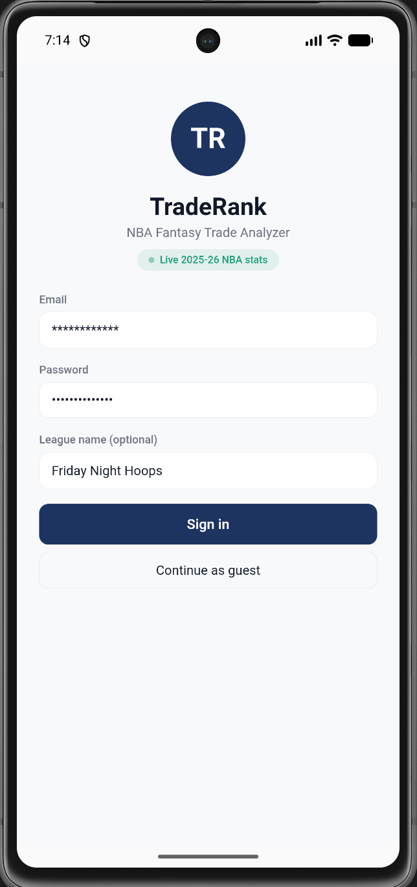
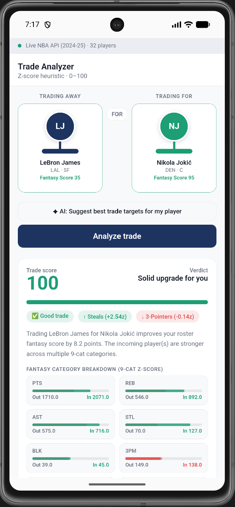
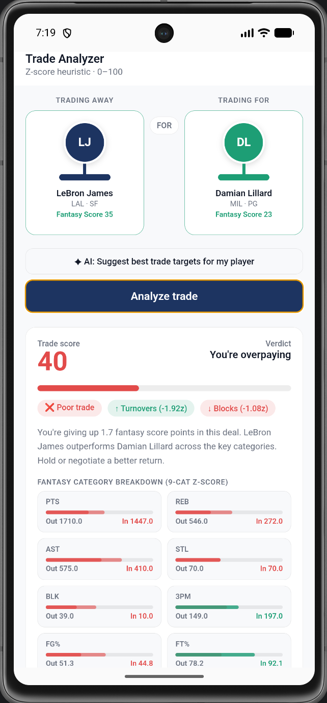

# TradeBall

<p align="center">
  <strong>An Android application for data-driven fantasy basketball trade analysis powered by live NBA statistics and custom heuristic algorithms.</strong>
</p>

<p align="center">


</p>

---

## Demo

<p align="center">
  
</p>

---

## Screenshots

| Login | Roster |
|-------|--------|
|  |  |

| Favorable Trade | Unfavorable Trade |
|----------------|-------------------|
|  |  |

---

# Overview

TradeBall is an Android application that helps fantasy basketball managers evaluate trades using live NBA statistics, historical player performance, and custom heuristic algorithms.

Unlike many fantasy trade calculators that simply assign a score, TradeBall explains *why* a trade is favorable by breaking down player value across standard nine-category fantasy basketball scoring. Users can build their roster, compare any NBA players, and receive detailed trade recommendations supported by transparent statistical analysis.

The application was designed to demonstrate Android development, REST API integration, heuristic algorithm design, and mobile application architecture while solving a real-world sports analytics problem.

---

# Motivation

Fantasy basketball trade decisions are frequently based on subjective opinions or basic statistical comparisons that fail to capture a player's complete fantasy value.

TradeBall was developed to provide a transparent, data-driven alternative that combines live NBA statistics with a custom evaluation engine capable of explaining the reasoning behind each trade recommendation rather than simply producing a numerical score.

The project also served as an opportunity to design and build a complete Android application integrating real-time APIs, custom algorithms, and an intuitive mobile user experience.

---

# Features

- Live NBA player statistics
- Fantasy roster management
- Search and compare any NBA players
- Trade evaluation using custom heuristic algorithms
- Intelligent trade explanations
- Category-by-category statistical comparisons
- Fantasy score generation
- Guest mode support
- Daily player data synchronization
- Mobile-first Android interface

---

# How TradeBall Works

TradeBall evaluates players using a custom **Z-score inspired heuristic model** designed around standard nine-category fantasy basketball scoring.

Each player is analyzed across the following categories:

- Points
- Rebounds
- Assists
- Steals
- Blocks
- Three-Point Field Goals
- Field Goal Percentage
- Free Throw Percentage
- Turnovers

The evaluation engine then:

- Calculates an overall fantasy value score
- Compares statistical strengths and weaknesses
- Identifies category-level gains and losses
- Produces a normalized trade score (0–100)
- Generates contextual explanations supporting the recommendation

This approach allows users to understand *why* a trade is recommended rather than relying solely on a single numerical rating.

---

# Technical Architecture

TradeBall consists of four primary components.

## Android Client

Provides the mobile interface for authentication, roster management, player search, and trade evaluation.

## Data Layer

Retrieves and synchronizes live NBA player statistics through REST API integrations while maintaining application data required for trade analysis.

## Evaluation Engine

Implements custom heuristic algorithms that calculate fantasy player value using weighted statistical analysis across nine scoring categories.

## Recommendation Engine

Processes evaluation results to generate trade recommendations, category breakdowns, and human-readable explanations for each proposed trade.

---

# Built With

| Category | Technologies |
|----------|--------------|
| Languages | Java, JavaScript, HTML, CSS |
| Mobile Development | Android Studio, Capacitor |
| APIs | NBA REST APIs |
| Version Control | Git, GitHub |

---

# Project Structure

```text
TradeBall/
│
├── android/                 Android application
├── www/                     Web frontend
├── images/                  README assets
├── package.json
├── capacitor.config.json
└── README.md
```

---

# Installation

Clone the repository.

```bash
git clone https://github.com/SaatwikJasti/TradeBall.git
```

Navigate to the project directory.

```bash
cd TradeBall
```

Install dependencies.

```bash
npm install
```

Synchronize Capacitor.

```bash
npx cap sync
```

Open the Android project.

```bash
npx cap open android
```

Run the application using Android Studio or an Android emulator.

---

# Key Contributions

This project demonstrates experience with:

- Android application development
- Mobile UI design
- REST API integration
- Heuristic algorithm design
- Statistical data analysis
- Mobile application architecture
- Git and GitHub version control
- Iterative software development driven by user feedback

Development was refined through testing and feedback collected from more than **25 fantasy basketball users across two competitive leagues**, improving player valuation accuracy and trade recommendation quality.

---

# Future Improvements

Potential future enhancements include:

- ESPN Fantasy integration
- Yahoo Fantasy integration
- Sleeper league support
- Multi-player trade analysis
- Dynasty league evaluation
- Team optimization recommendations
- Waiver wire analysis
- Injury-adjusted player projections
- League-specific scoring customization

---

# License

This project is licensed under the MIT License.

---

# Disclaimer

TradeBall is an independent software project developed for educational and portfolio purposes. It is not affiliated with or endorsed by the NBA or any fantasy sports platform. Player statistics are obtained from publicly available basketball data sources.